# Barmlo ERP User Manual

## Document Control

- Document title: Barmlo ERP User Manual
- Document type: Client-facing operating guide
- Audience: Clients, management, administrators, trainers, and end users
- Version: 2.0
- Date: 2026-06-05
- Basis: Current deployed interface, protected navigation, and workflow rules in the repository

## 1. Introduction

### 1.1 What this manual is for

This manual explains how Barmlo ERP works in plain business language. It is written for readers who may not know the internal technical design of the system. It describes what each user role does, why each task matters, when each task is performed in the business process, and how the user completes that task in the application.

### 1.2 What Barmlo ERP is

Barmlo ERP is a role-based business operations system used to move work from quotation to project execution. It helps the business manage:

- quotations and approvals
- sales negotiation and endorsement
- project planning and coordination
- requisitions and procurement
- dispatch and delivery tracking
- payments and project reporting
- administrative control and audit visibility

### 1.3 How to use this manual

If you are new to the system, read these sections in order:

1. System access
2. Core business journey
3. Navigation and role-based access
4. The section for your role

If you already know the system and only need task guidance, go directly to the section for your role and read the task guides under that heading.

## 2. System Access

### 2.1 Signing in

What:

- Signing in gives the user access to the modules assigned to their role.

Why:

- Barmlo ERP is role-based. Each user sees only the pages relevant to their work.

When:

- At the start of each working session.

How:

1. Open the Barmlo ERP login page.
2. Enter your assigned email address.
3. Enter your password.
4. Select **Sign in**.
5. Wait for the system to open the dashboard.

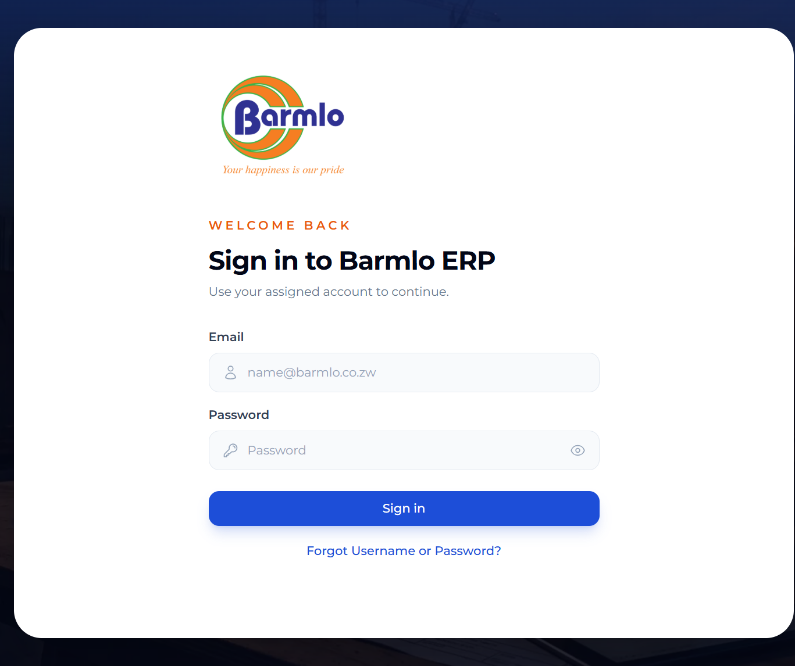

### 2.2 What happens if the user is not signed in

What:

- Protected pages cannot be used without an active session.

Why:

- This protects operational and financial data.

When:

- If a session expires or a protected page is opened directly.

How:

1. The user is prompted to sign in again.
2. The user re-enters credentials and resumes work.

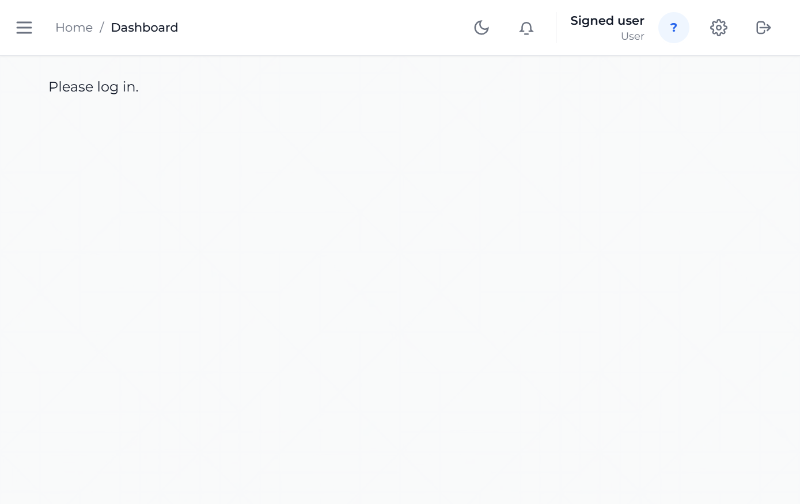

## 3. Core Business Journey

Before looking at individual roles, it helps to understand the overall business flow.

### 3.1 Quote to Project Journey

1. A QS prepares a quotation.
2. A Senior QS reviews it.
3. Sales negotiates the commercial position.
4. Sales endorses the accepted deal.
5. The system creates or updates the related project.

### 3.2 Project to Procurement Journey

1. Project-side users identify what is needed for delivery.
2. A requisition is raised.
3. Procurement requests funding where required.
4. Accounts approves or rejects funding.
5. Procurement records the purchase.

### 3.3 Dispatch to Delivery Journey

1. Operations prepares a dispatch.
2. Security approves release.
3. Driver handles pickup or delivery.
4. Site-facing users track what is arriving.

### 3.4 Payment and Reporting Journey

1. Sales endorsement defines the payment structure.
2. Sales Accounts and finance teams track due payments.
3. Payments are recorded against the project.
4. Payment history and profit/loss reports support oversight.

## 4. Navigation and Role-Based Access

### 4.1 How navigation works

The left sidebar changes depending on the signed-in user role. This keeps the interface focused and prevents users from seeing pages that are unrelated to their work.

### 4.2 What users should expect

- A QS sees quote creation and quote tracking pages.
- A Senior QS sees broader quotation control plus manual items and rates.
- Sales sees negotiation and endorsement queues.
- Project-side users see projects, schedules, requisitions, dispatches, and reports.
- Procurement sees procurement and purchase order pages.
- Finance users see payments, funding, and financial reporting.
- Administrators see users, audit logs, and recycle bin functions.

## 5. Role Directory

The following roles were verified from the system navigation and, where credentials were provided, from the live deployed interface:

- QS
- Senior QS
- Sales
- Sales Accounts
- Project Coordinator
- Project Operations Officer
- Procurement
- Senior Procurement
- Security
- Driver
- Managing Director
- Administrator functions in the codebase
- Accounts and accounting roles in the codebase
- Foreman in the codebase
- Client, Viewer, PM Clerk, and Human Resource roles in the codebase

Roles that exist in the codebase but were not supplied with working screenshot credentials are still described in this manual, but their screenshots are intentionally not included.

## 6. QS Guide

### 6.1 Role purpose

The QS starts the commercial process by preparing quotations. This role is the point where client requirements become a structured commercial document.

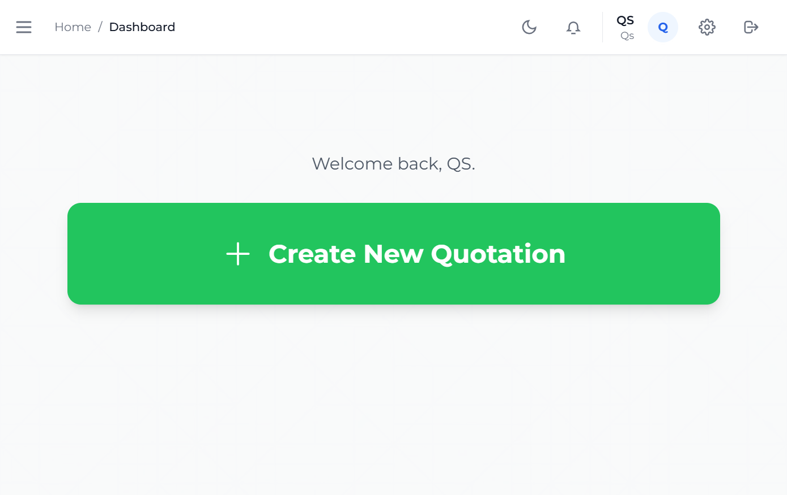

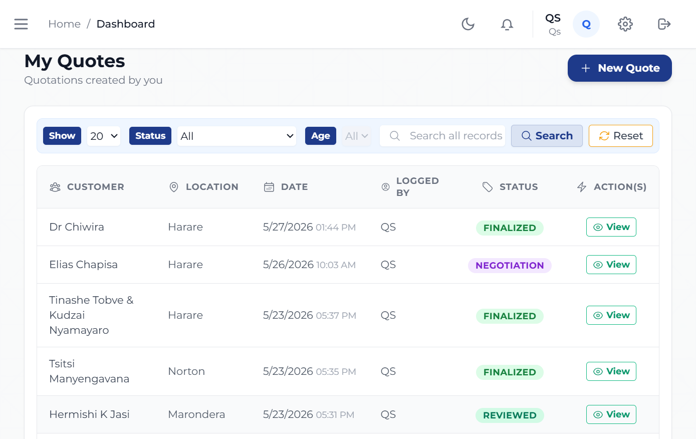

### 6.2 Task: Create a new quotation

What:

- Create a quotation for a client requirement.

Why:

- The quotation is the commercial starting point for the rest of the business process.

When:

- When a new customer request, project opportunity, or pricing exercise is received.

How:

1. Open **New Quote** from the sidebar.
2. Enter the customer and quote details.
3. Add line items, measurements, or cost-driving values.
4. Review the totals shown by the system.
5. If the system shows fields that need attention, complete the highlighted information before generating the final quotation.
6. Save the quote as a draft if work is still in progress, or generate the quotation when the details are complete.

### 6.3 Task: Save a quotation as draft

What:

- Save the current quotation inputs before generating the quotation.

Why:

- This protects work that is still in progress. A QS can leave the desk, attend to another task, or gather missing information without losing the measurements and customer details already entered.

When:

- When the quote is not yet complete.
- When the QS needs to pause before generating the quotation.
- When some customer or measurement information still needs confirmation.

How:

1. Open **New Quote** and enter the available information.
2. Click **Save to Draft**.
3. Return later through **My Quotes**.
4. Select **Continue Draft** for the saved draft quote.
5. Complete the missing details and generate the quotation when ready.

### 6.4 Task: Work from My Quotes

What:

- Use **My Quotes** to manage the quotations already assigned to the QS.

Why:

- This helps the QS return to unfinished work, review progress, and track which quotes are ready for submission.

When:

- Throughout the day while preparing or revising quotations.

How:

1. Open **My Quotes**.
2. Find the quote by number, customer, or status.
3. Choose **Continue Draft** for draft quotations, or open submitted quotations to review their progress.
4. Continue editing draft details or reviewing readiness.

### 6.5 Task: Submit a quote for review

What:

- Send a completed quote forward for Senior QS review.

Why:

- Quotes should not move to sales without internal review.

When:

- After the QS has completed the commercial preparation and internal checking.

How:

1. Open the completed quote.
2. Confirm the pricing, quantities, and structure are ready.
3. Click **Generate Quotation**.
4. If any required information is missing, review the attention message and highlighted fields.
5. Complete the missing items and click **Generate Quotation** again.
6. Confirm that the quote no longer remains a draft.

## 7. Senior QS Guide

### 7.1 Role purpose

The Senior QS is responsible for commercial control before a quotation reaches Sales. This role helps protect pricing quality, consistency, and technical correctness.

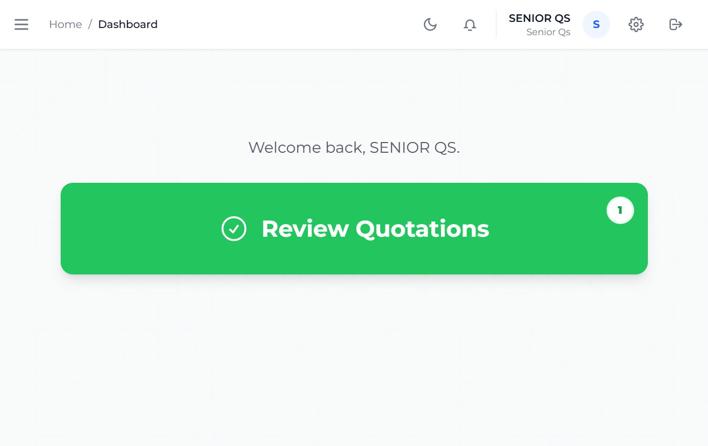

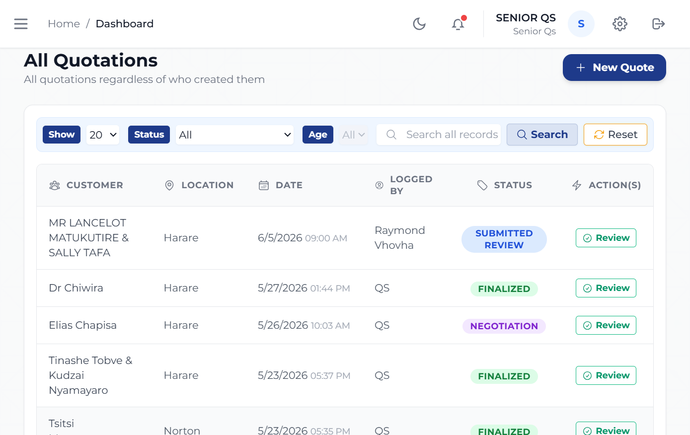

### 7.2 Task: Review submitted quotations

What:

- Review quotations prepared by QS users.

Why:

- Senior review reduces commercial errors before the quote reaches the customer-facing sales stage.

When:

- After a QS submits a quote for review.

How:

1. Open **All Quotations**.
2. Locate the submitted quotation.
3. Review the line structure, pricing logic, and overall readiness.
4. Return the quote for correction if it is not ready, or move it forward if it is ready.

### 7.3 Task: Send a quote to Sales

What:

- Move the quotation from internal review into the Sales queue.

Why:

- Sales cannot negotiate or endorse a quote that has not passed internal review.

When:

- Once the Senior QS is satisfied that the quote is ready for commercial engagement.

How:

1. Open the reviewed quotation.
2. Confirm the quote is ready for customer-facing handling.
3. Use the action that routes the quote to Sales.

### 7.4 Task: Manage manual items

What:

- Maintain the manual item catalogue.

Why:

- Manual items support pricing flexibility where standard catalogue items are not sufficient.

When:

- When pricing structures need additional configurable items.

How:

1. Open **Manual Items**.
2. Review the existing manual item list.
3. Add or maintain the approved catalogue entries according to internal policy.

### 7.5 Task: Manage rates

What:

- Maintain the rate structures used in quoting.

Why:

- Up-to-date rates protect pricing accuracy and margin control.

When:

- When rates are revised, approved, or standardized.

How:

1. Open **Rates**.
2. Review the existing rates.
3. Apply approved changes carefully.
4. Confirm that the revised rates are available to quotation workflows.

## 8. Sales Guide

### 8.1 Role purpose

Sales is responsible for commercial engagement after internal review. This role manages negotiation and moves accepted opportunities into executable projects.

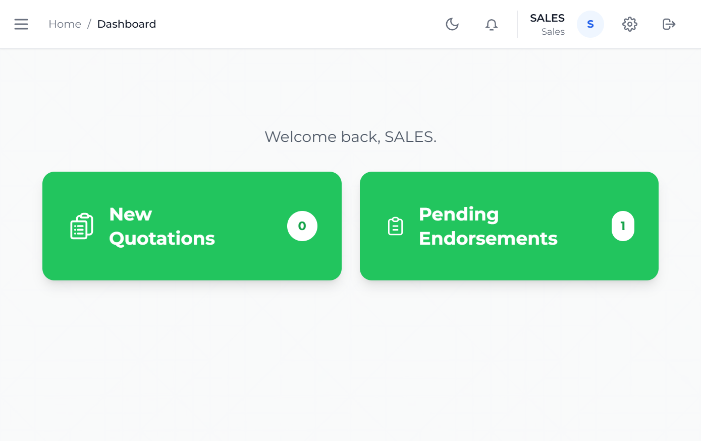

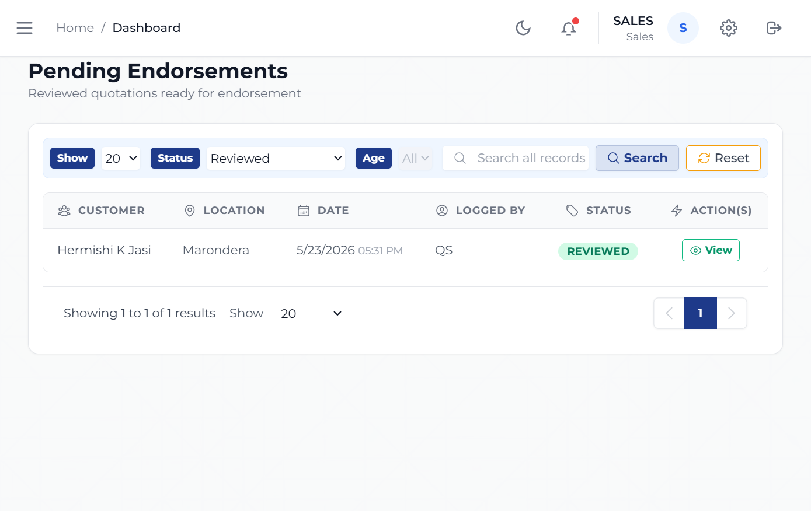

### 8.2 Task: Review the sales quotation queue

What:

- Review quotations that have been sent to Sales.

Why:

- Sales needs clear visibility into which quotations are ready for negotiation or client engagement.

When:

- After Senior QS sends a quote to Sales.

How:

1. Open the sales quotation queue from the sidebar.
2. Review the available quote list.
3. Open the quote that needs action.

### 8.3 Task: Manage negotiation

What:

- Work with the client on the commercial position of the quotation.

Why:

- The negotiation stage allows the business to move from an internal estimate to an agreed deal.

When:

- Once the quote is commercially ready and being discussed with the client.

How:

1. Open the relevant quote in the Sales queue.
2. Review the negotiated position.
3. Coordinate any commercial adjustments with Senior QS where required.
4. Continue until the quote is ready for endorsement.

### 8.4 Task: Endorse an accepted deal

What:

- Capture the commercial commitments that allow the system to create the project record.

Why:

- Endorsement turns an accepted quote into an operationally manageable project.

When:

- After the client has accepted the commercial terms.

How:

1. Open **Pending Endorsements**.
2. Select the accepted quotation.
3. Enter the commencement date.
4. Enter the deposit amount.
5. Enter the expected installment amount.
6. Enter the due day.
7. Submit the endorsement.
8. Confirm the project now exists in the project pipeline.

## 9. Sales Accounts Guide

### 9.1 Role purpose

Sales Accounts helps the business track expected receipts after deals move into execution.

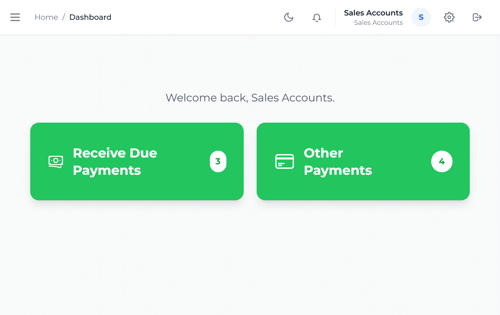

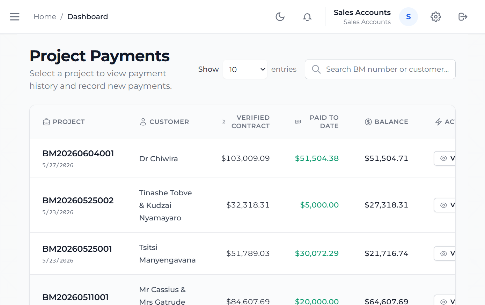

### 9.2 Task: View due payments

What:

- Review payments that are due for collection and identify which client receipts need action.

Why:

- Payment visibility supports follow-up and cashflow discipline.

When:

- Daily, especially around due dates.

How:

1. Open **Receive Due Payments**.
2. Review the projects with due, partial, or overdue payment obligations.
3. Open the relevant project to confirm the expected amount and timing.

### 9.3 Task: Receive and record due payments

What:

- Record money received from the client against the correct project payment obligation.

Why:

- This updates the customer account, keeps the payment schedule accurate, and gives the rest of the business a reliable view of what has actually been paid.

When:

- Whenever a client deposit or installment is received.
- When Sales Accounts needs to update the system after confirming payment evidence.

How:

1. Open **Receive Due Payments** and select the project that needs payment posting.
2. Open the payment screen for that project.
3. Confirm the payment type, such as deposit or installment.
4. Enter the amount received, the receipt reference, the date received, and the payment method.
5. Save the payment record.
6. Confirm the payment schedule and paid-to-date values have updated.

### 9.4 Task: Review payment activity

What:

- Use the payments view to see ongoing payment activity.

Why:

- This helps the business separate expected cash from already received cash.

When:

- During payment follow-up and end-of-day finance review.

How:

1. Open **Payments**.
2. Review the listed project payment records and paid-to-date values.
3. Use the project and customer references to follow specific customer accounts.
4. Open a project when more detailed payment history or another new payment entry is needed.

### 9.5 Task: Review other payments

What:

- Review projects that have payment activity outside the immediate due-today list.

Why:

- This helps Sales Accounts stay ahead of future collections and keep visibility across all live receivables.

When:

- During broader receivables review, follow-up preparation, and account monitoring.

How:

1. Open **Other Payments**.
2. Review projects with future or non-immediate payment schedules.
3. Open the relevant project to inspect outstanding balances and prior receipts.

## 10. Project Coordinator Guide

### 10.1 Role purpose

The Project Coordinator manages assignment, planning, reporting, and operational visibility across active work.

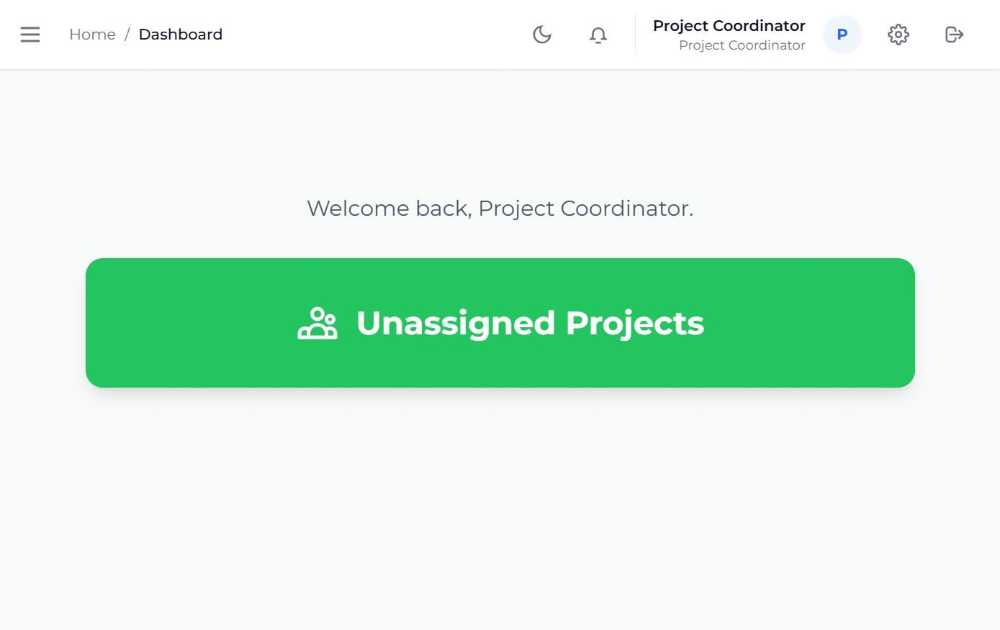

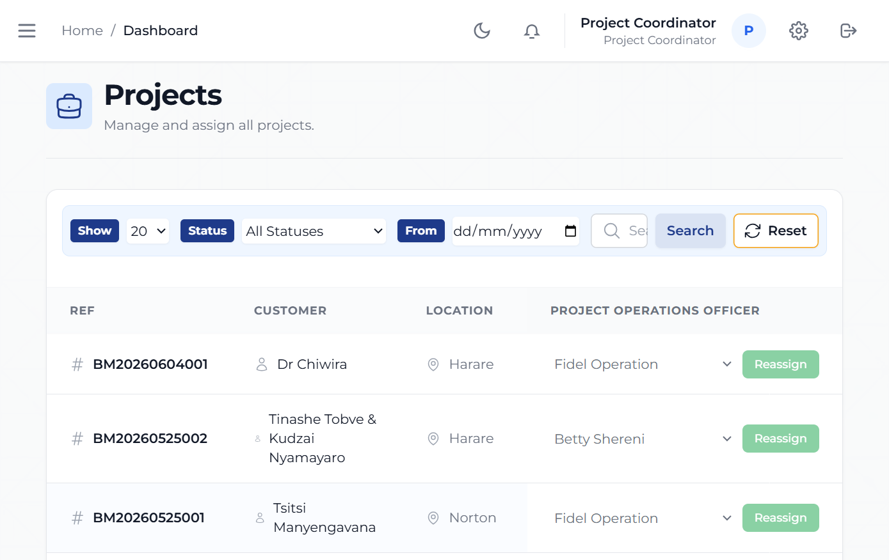

### 10.2 Task: Review active projects

What:

- Use the active project view to monitor ongoing work.

Why:

- Coordination depends on clear visibility into what is live and what needs attention.

When:

- Daily, during planning meetings, and when following up project execution.

How:

1. Open **Active Projects**.
2. Review the project list.
3. Open the project that needs coordination action.

### 10.3 Task: Review unassigned and planning-pending projects

What:

- Track projects that still require assignment or planning.

Why:

- This prevents accepted work from sitting idle after endorsement.

When:

- After new projects are created and during planning reviews.

How:

1. Open **Unassigned Projects** or **Planning Pending**.
2. Review which projects still need action.
3. Escalate or coordinate the next planning step.

### 10.4 Task: Review project reports

What:

- Use project reports to monitor financial and material performance.

Why:

- Coordination is not only about scheduling. It also depends on cost, materials, and payment visibility.

When:

- During project reviews, management updates, and end-of-period reporting.

How:

1. Open **Payment History**, **Material Reconciliation**, or **Profit and Loss**.
2. Select the project or report view.
3. Review the status and identify follow-up items.

## 11. Project Operations Officer Guide

### 11.1 Role purpose

The Project Operations Officer manages the day-to-day operational side of project delivery.

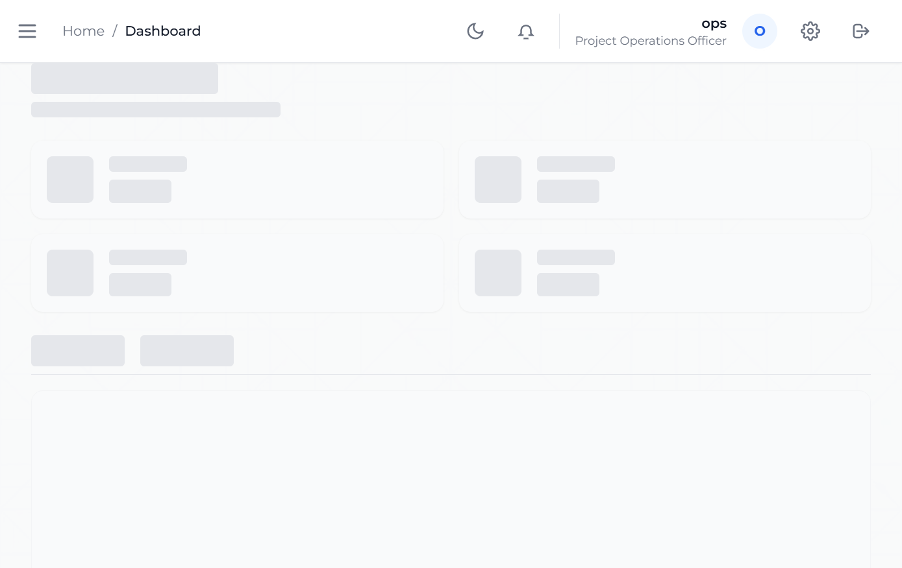

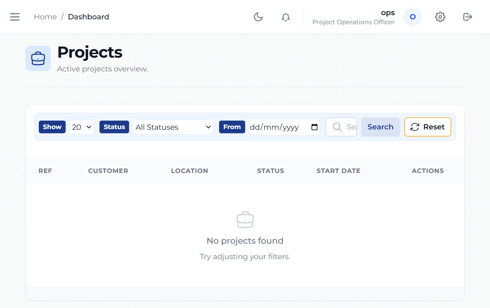

### 11.2 Task: Review operational project workload

What:

- Use the project views to understand active operational workload.

Why:

- Operations teams need immediate visibility into which projects need action.

When:

- Daily and before raising requisitions or dispatches.

How:

1. Open **Projects**.
2. Review the project list and priorities.
3. Open the project requiring action.

### 11.3 Task: Raise requisitions

What:

- Create material or service demand records for a project.

Why:

- Requisitions are the formal starting point for procurement support.

When:

- When a project needs materials, supplies, or other operational inputs.

How:

1. Open **Requisitions**.
2. Select the project.
3. Enter the required requisition details.
4. Submit the requisition for downstream processing.

### 11.4 Task: Create dispatches

What:

- Prepare items for release or delivery.

Why:

- Dispatch records help control movement of materials from the business to site.

When:

- When materials are approved and ready to move.

How:

1. Open **Dispatches**.
2. Select the project or dispatch context.
3. Enter the items to be delivered.
4. Save the dispatch for the next approval stage.

### 11.5 Task: Review schedules and daily tasks

What:

- Check the planned work for projects and teams.

Why:

- Scheduling and daily task visibility help keep operations aligned with delivery commitments.

When:

- At the start of the day and before site coordination.

How:

1. Open **View Schedules** or **View Daily Tasks**.
2. Review assigned activities.
3. Use the information to plan the next operational actions.

## 12. Procurement Guide

### 12.1 Role purpose

Procurement converts approved demand into purchases.

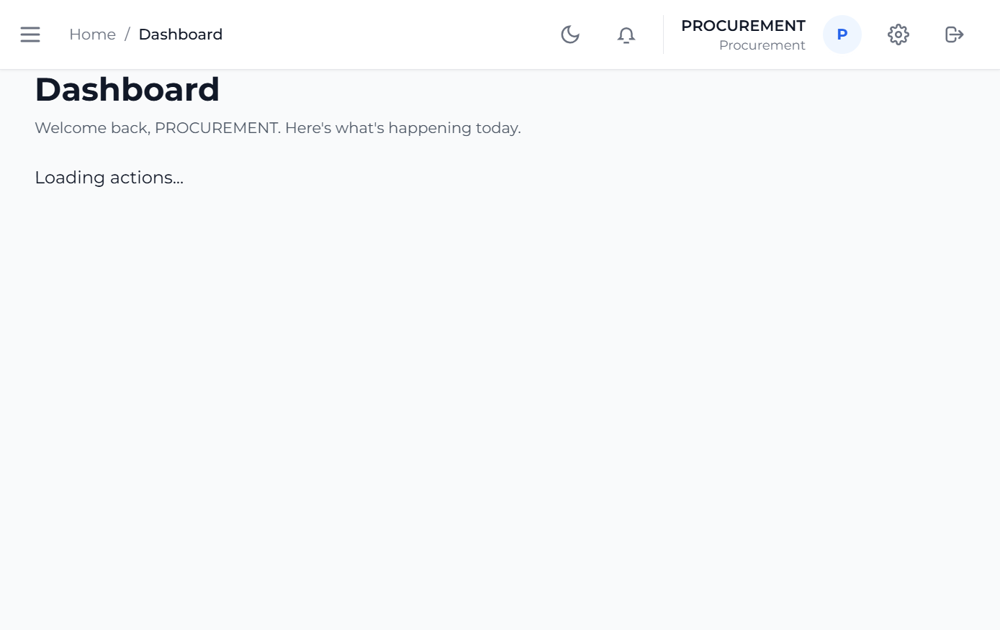

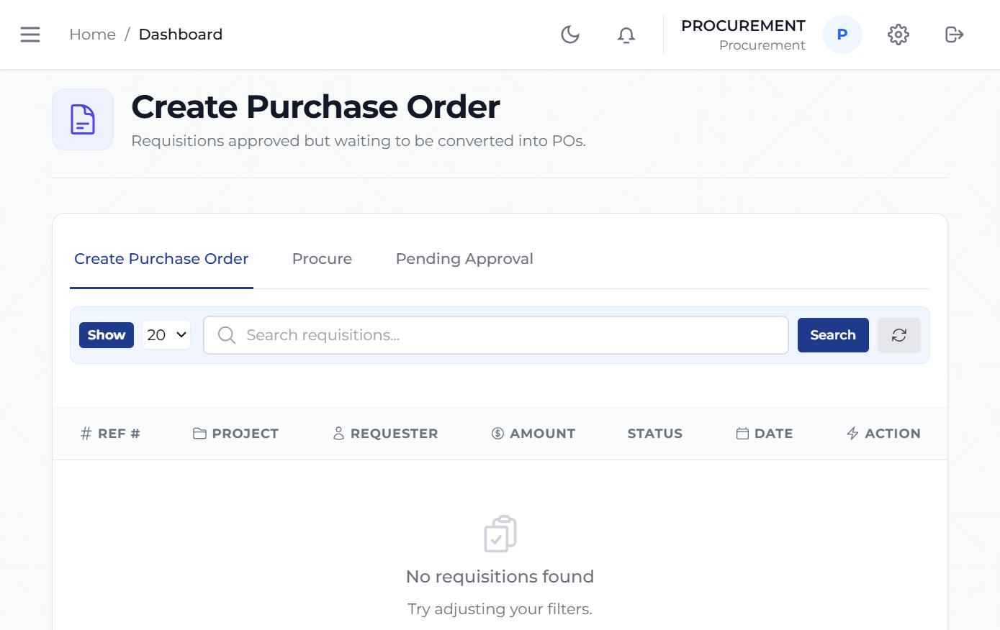

### 12.2 Task: Review purchase orders and requisitions

What:

- Use procurement pages to see what has been requested and what requires purchasing action.

Why:

- Procurement needs a clean queue of work to keep projects supplied.

When:

- Daily or whenever requisitions are raised.

How:

1. Open **Purchase Orders** or **All POs**.
2. Review the listed procurement items.
3. Open the relevant entry.

### 12.3 Task: Request funding

What:

- Move a procurement need into the funding approval path.

Why:

- Funding approval is required before procurement can proceed in controlled workflows.

When:

- After the demand is confirmed and before purchase execution.

How:

1. Open the relevant requisition or procurement request.
2. Enter the required funding request information.
3. Submit the request for Accounts review.

### 12.4 Task: Record a purchase

What:

- Capture the purchasing outcome in the system.

Why:

- Recording the purchase creates traceability for project cost and supplier activity.

When:

- After a purchase is completed.

How:

1. Open the procurement record.
2. Enter vendor details.
3. Enter the tax invoice number.
4. Enter the price and date.
5. Save the purchase record.

## 13. Senior Procurement Guide

### 13.1 Role purpose

Senior Procurement supervises procurement exceptions and approvals that require a higher level of control.

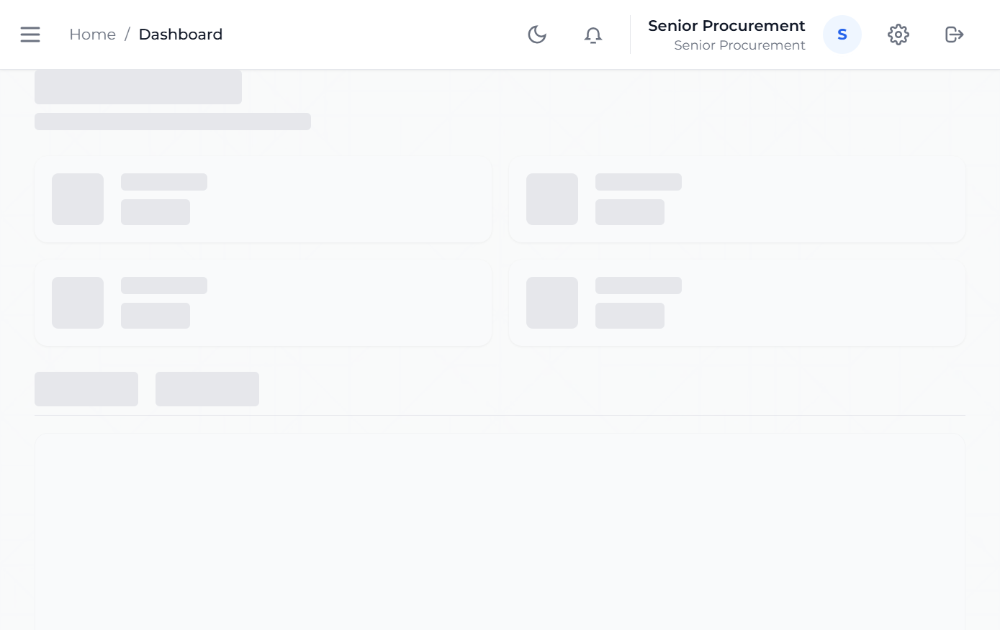

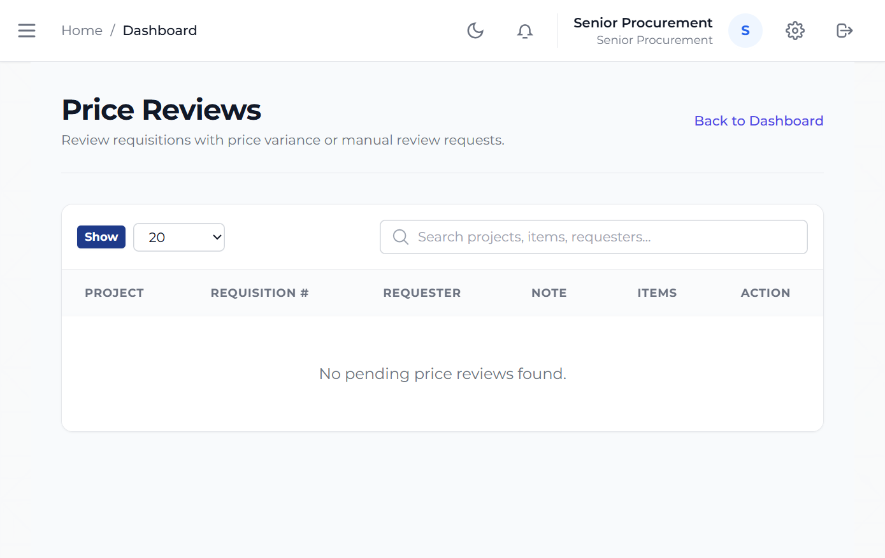

### 13.2 Task: Review price changes

What:

- Review procurement cases where the expected price has changed.

Why:

- Price changes affect project cost control and require oversight.

When:

- When an item cannot be procured at the previously expected amount.

How:

1. Open **Price Reviews**.
2. Review the request details.
3. Confirm the commercial justification according to company policy.

### 13.3 Task: Review quantity top-ups

What:

- Review cases where additional quantity is requested beyond the earlier expectation.

Why:

- Quantity increases can materially affect cost and planning.

When:

- When a project requires additional supply or scope coverage.

How:

1. Open **Quantity Top-Ups**.
2. Review the request.
3. Confirm the operational and commercial justification.

## 14. Security Guide

### 14.1 Role purpose

Security controls the authorized release of dispatches.

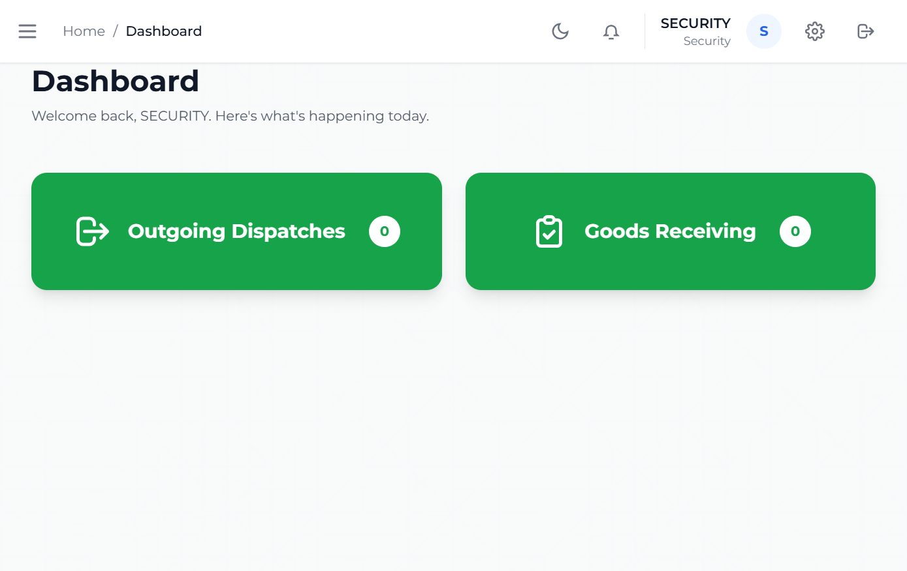

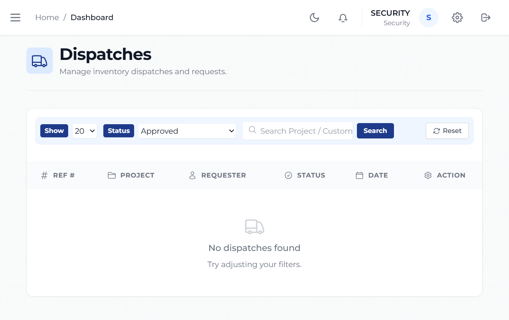

### 14.2 Task: Review dispatches for release

What:

- Review dispatches before goods leave controlled custody.

Why:

- Dispatch control protects stock movement and accountability.

When:

- When a dispatch is ready for release.

How:

1. Open **Dispatches**.
2. Review the dispatch record.
3. Confirm the driver or movement information.
4. Approve the dispatch when the release conditions are met.

### 14.3 Task: Support delivery confirmation

What:

- Help confirm that dispatched goods reached the intended stage or destination.

Why:

- Delivery closure is part of the accountability chain.

When:

- After dispatch release and during delivery completion.

How:

1. Open the relevant dispatch record.
2. Review the current movement status.
3. Update or confirm the completion stage according to policy.

## 15. Driver Guide

### 15.1 Role purpose

The Driver role is the transport-facing view of the dispatch process.

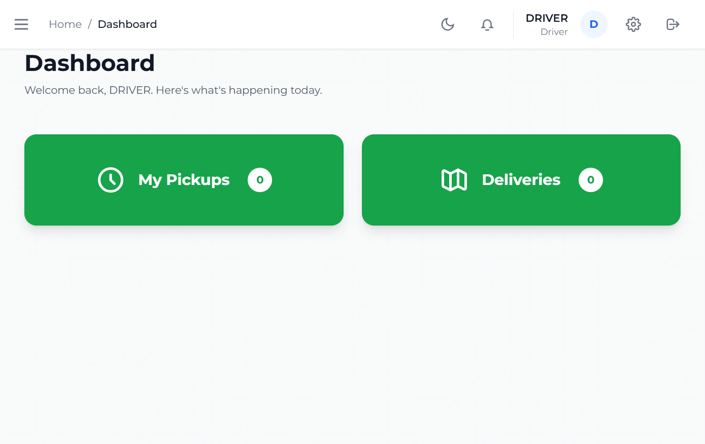

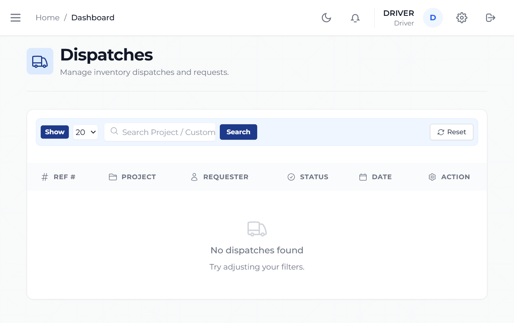

### 15.2 Task: Review assigned pickups

What:

- Review the items that the driver is expected to collect or move.

Why:

- The driver needs a clear worklist for transport execution.

When:

- Before leaving for pickup or delivery.

How:

1. Open **My Pickups**.
2. Review the assigned records.
3. Confirm the relevant pickup details.

### 15.3 Task: Track deliveries in progress

What:

- Use the delivery views to manage work that is currently underway.

Why:

- This reduces confusion between new, active, and completed transport tasks.

When:

- While goods are in transit.

How:

1. Open **Deliveries**.
2. Review the current delivery items.
3. Follow the status through to completion.

### 15.4 Task: Review settled deliveries

What:

- Review deliveries that have already been completed.

Why:

- This gives the driver a completed record and helps confirm closure.

When:

- After deliveries are finalized.

How:

1. Open **Settled**.
2. Review the completed movement list.

## 16. Managing Director Guide

### 16.1 Role purpose

The Managing Director has oversight visibility across projects, reports, assets, and employees.

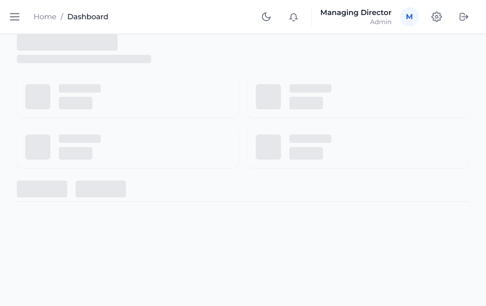

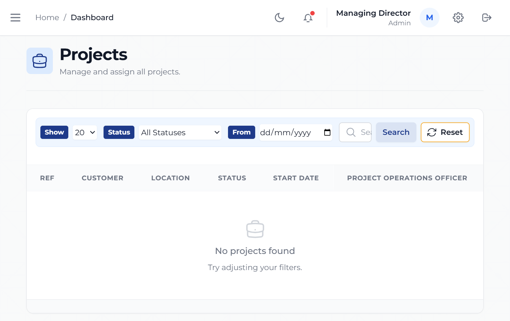

### 16.2 Task: Review project position

What:

- Use the project views to understand the state of current business delivery.

Why:

- Executive leadership needs visibility into active workload and bottlenecks.

When:

- During operational reviews and management reporting.

How:

1. Open **Projects**.
2. Review the list of current projects.
3. Open specific items where a deeper review is needed.

### 16.3 Task: Review reports, assets, and employees

What:

- Use executive-access views to monitor the broader operating environment.

Why:

- Oversight depends on more than project counts alone.

When:

- During strategic reviews, resource checks, and management meetings.

How:

1. Open the relevant executive-access module.
2. Review the information presented.
3. Use the findings to guide operational follow-up.

## 17. Accounts and Accounting Roles

The codebase includes `ACCOUNTS`, `ACCOUNTING_CLERK`, `ACCOUNTING_OFFICER`, `ACCOUNTING_AUDITOR`, and `CASHIER` roles. These roles were identified from the protected navigation and workflow rules, but live screenshots were not captured because credentials were not provided.

### 17.1 What these roles do

- review funding requests
- approve or reject funding
- review payment history
- review profit and loss views
- access payments and finance-related operational pages

### 17.2 Why these tasks matter

- Finance control protects cashflow, procurement discipline, and project reporting accuracy.

### 17.3 When these tasks happen

- when procurement requests funding
- when client payments are received
- during daily finance review
- during end-of-period reporting

### 17.4 How these users normally work

1. Open the finance module relevant to the task.
2. Review the underlying project or funding record.
3. Confirm the financial details.
4. Approve, reject, or record the financial outcome according to policy.

## 18. Administrator Guide

Administrative control surfaces are clearly present in the codebase, including **Users**, **Audit Logs**, and **Recycle Bin**. A dedicated administrator screenshot was not captured because an explicit admin credential was not supplied. The deployed Managing Director session was verified separately and is documented above, but administrative controls are described here from the system navigation and role rules.

### 18.1 Task: Manage users

What:

- Control who can sign in and what role they hold.

Why:

- Role assignment is the foundation of secure system use.

When:

- When a new staff member joins, leaves, changes role, or needs access adjustment.

How:

1. Open **Users**.
2. Review the account list.
3. Create, update, or disable accounts according to policy.

### 18.2 Task: Review audit logs

What:

- Check historical user and system activity.

Why:

- Audit visibility supports compliance, traceability, and troubleshooting.

When:

- During investigations, management review, or exception handling.

How:

1. Open **Audit Logs**.
2. Search or review the relevant activity records.
3. Use the record trail for follow-up action.

### 18.3 Task: Use the recycle bin

What:

- Review or restore deleted quotation records.

Why:

- Recovery features reduce the risk of accidental data loss.

When:

- When a quotation was removed in error or needs administrative review.

How:

1. Open **Recycle Bin**.
2. Review the deleted quotation list.
3. Restore or inspect the required record according to policy.

## 19. Roles with Limited Confirmed Surface

The following roles exist in the codebase but do not currently have enough confirmed live surface in this documentation set to support screenshot-backed step-by-step instructions:

- Client
- Viewer
- PM Clerk
- Human Resource
- Foreman
- General Manager

Where these roles are visible in the codebase, their likely purpose is reflected by the route names and access rules. However, this manual avoids inventing unsupported task detail.

## 20. Common Questions

### 20.1 Why can one user see pages that another user cannot?

The system menu is role-based. Different roles receive different operational views.

### 20.2 Why does a quote not move forward automatically?

The quote may still be in a status that requires action from a different role, such as Senior QS or Sales.

### 20.3 Why can a user open the dashboard but not a certain module?

The user may have a valid session but lack the role required for that module.

### 20.4 Why are some roles in this manual described without screenshots?

Only the credentials supplied for this documentation pass were used for live screenshots. For unspecified roles, the manual relies on confirmed route and role definitions instead of creating content in the live system.

## 21. Screenshot Register

Included screenshots:

- login screen
- unauthenticated session example
- QS dashboard and My Quotes
- Senior QS dashboard and quotation view
- Sales dashboard and endorsement queue
- Sales Accounts dashboard and payments view
- Project Coordinator dashboard and active projects view
- Project Operations Officer dashboard and projects view
- Procurement dashboard and purchase orders view
- Senior Procurement dashboard and approvals view
- Security dashboard and dispatch view
- Driver dashboard and pickups view
- Managing Director dashboard and projects view

## 22. Final Note

This manual is designed to be understandable by a client or stakeholder who has not worked inside the system before. It explains the visible business purpose of each role and avoids technical implementation language unless it is necessary to clarify how the system is meant to be used.

